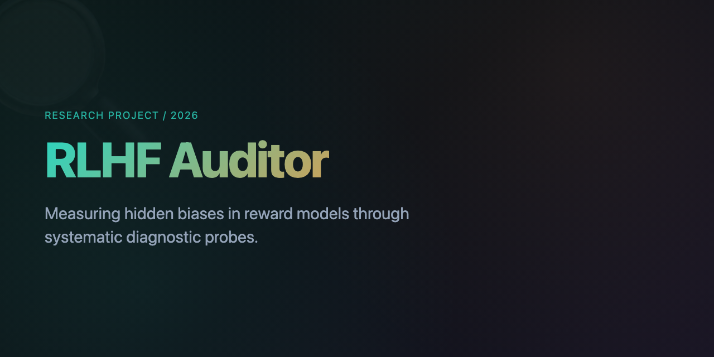

<p align="center">
  
</p>

# RLHF Auditor: Measuring Hidden Biases in Reward Models

A diagnostic framework for systematically probing RLHF reward models for latent biases that may compromise alignment quality.

## Background

Reinforcement Learning from Human Feedback (RLHF) has become the dominant paradigm for aligning large language models. However, the reward models at the core of this pipeline are rarely audited for systematic biases. Recent work has identified several pathologies: length bias, sycophancy, position effects, jailbreak susceptibility, social desirability bias, and formatting preferences.

This project provides a reproducible probe suite to quantify these biases in any reward model.

## Research Questions

1. How prevalent is length bias in production reward models?
2. Do reward models exhibit sycophancy, preferring agreeable responses over accurate ones?
3. Can reward models be manipulated via adversarial prompts to rate harmful outputs highly?

## Probe Dimensions

| Probe | Target Bias | Method |
|-------|-------------|--------|
| Length Bias | Preferring longer responses regardless of quality | Same content at multiple lengths |
| Sycophancy | Preferring agreeable over correct responses | Contrarian vs agreeable pairs |
| Position Bias | Order effects in pairwise comparison | Swapped A/B presentation |
| Jailbreak Susceptibility | Adversarial manipulation of scores | Crafted prompts that elicit praise |
| Social Desirability | Preferring polite over accurate | Polite-but-wrong vs blunt-but-right |
| Style Bias | Preferring certain formatting | Same content, different presentation |

## Architecture

```
rlhf-auditor/
├── probes/              # One probe per bias dimension
│   ├── length_bias.py
│   ├── sycophancy.py
│   ├── position_bias.py
│   ├── jailbreak.py
│   ├── desirability.py
│   └── style_bias.py
├── models/              # Reward model loaders
├── benchmark/           # Synthetic and validated test cases
├── dashboard/           # Trust report visualization
└── reports/             # Generated audit outputs
```

## Usage

```python
from probe import RewardModelProbe

probe = RewardModelProbe("OpenAssistant/reward-model-deberta-v3-large")
audit = probe.run_full_audit()

print(f"Trust Score: {audit['trust_score']:.0f}/100")
print(f"Verdict: {audit['overall_verdict']}")
```

## Output Format

```
Reward Model Audit: [model_name]
Date: [timestamp]

TRUST SCORE: [0-100]

Bias Dimensions:
- Length bias:        [correlation]  ([verdict])
- Sycophancy:         [rate]         ([verdict])
- Position bias:      [inconsistency] ([verdict])
- Jailbreak suscept:  [adversarial_score] ([verdict])
- Social desirability: [preference_delta] ([verdict])
- Style bias:         [format_correlation] ([verdict])

Recommendation: [assessment]
```

## Dependencies

```
torch>=2.0.0
transformers>=4.35.0
streamlit
```

## Current Status

Two probes implemented: length bias and sycophancy. The framework supports adding new probes modularly.

## Citation

```
@software{rlhf_auditor_2026,
  author = {Vardhan, Manas},
  title = {RLHF Auditor: Measuring Hidden Biases in Reward Models},
  year = {2026},
  url = {https://github.com/ManasVardhan/rlhf-auditor}
}
```

## License

MIT
